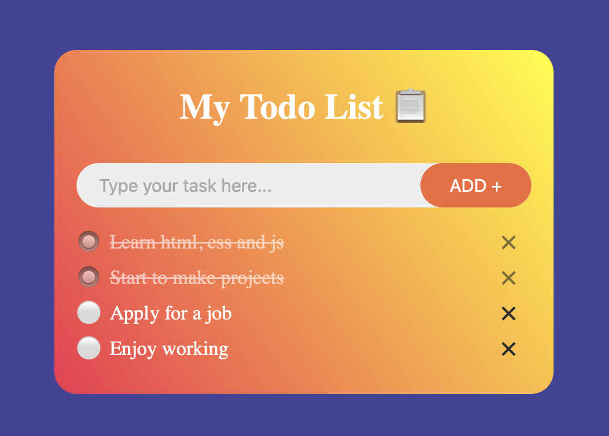

# 📋 Simple Todo List

A lightweight and functional Todo List application built with HTML, CSS and pure JavaScript(Vanilla).

## 🧠 Features
- **Smart Formatting:** Automatically capitalizes the first letter of your tasks and removes unnecessary whitespacesfrom the beginning and end of your tasks.**
- **Persistence:** Uses `localStorage` to save your list. Your tasks stay there even after refreshing the page!
- **Interactive UI:** 
  - Click a task to mark it as completed (strikethrough).
  - Click the `×` icon to remove a task.
  - Press `Enter` or click `Add` to create a new task.

## 🛠️ Built With
- **HTML5**
- **CSS3** (Custom styles in `style.css`)
- **JavaScript** (Vanilla JS)

## 🗝 How to Use
1. Clone the repository:
   ```bash
   git clone https://github.com/Jellu28/Easy-ToDo-List.git
   ```
2. Open `index.html` in your favorite browser.

## 📥 Script Logic
The app uses `list.innerHTML` to store the entire state of the list in the browser's memory, ensuring that even the HTML structure and classes (like `.checked`) are preserved.
